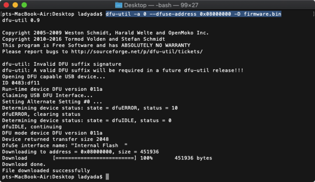
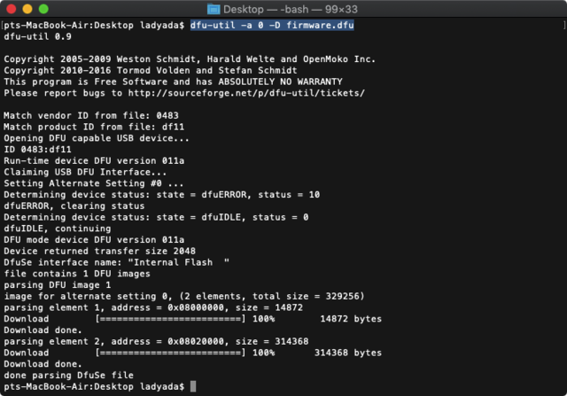

# dfu-util
---

# Windows | Mac | Linux

For Mac users, install dfu-util with brew `brew install dfu-util`

For Linux users, 
Ubuntu/Debian: `sudo apt-get install dfu-util`
Fedora: `yum install dfu-util`

For windows users, [download here](https://sourceforge.net/projects/dfu-util/)

Upload the firmware with the command:
`dfu-util -a 0 --dfuse-address 0x08000000 -D firmware.bin`
Don't change the address value, only the firmware filename!

Upon success, reset the board without the BOOT button and you will see after a few seconds the screen light up.