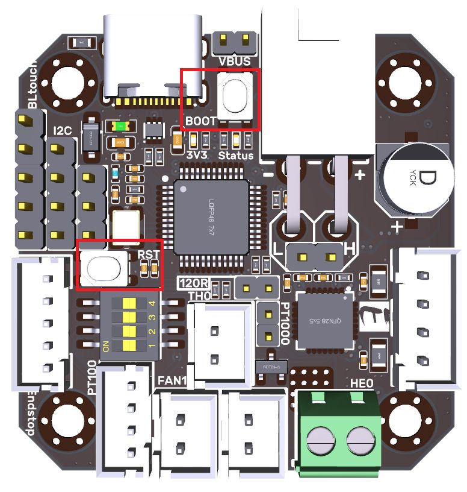
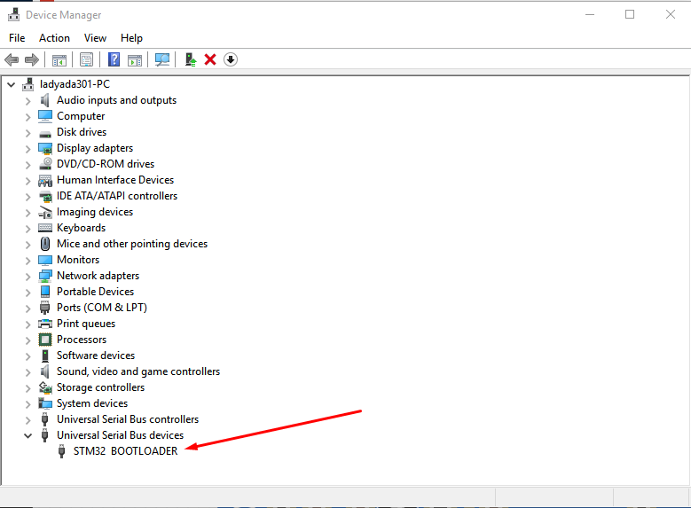
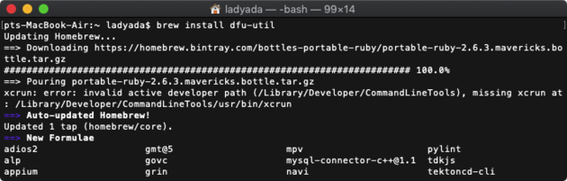
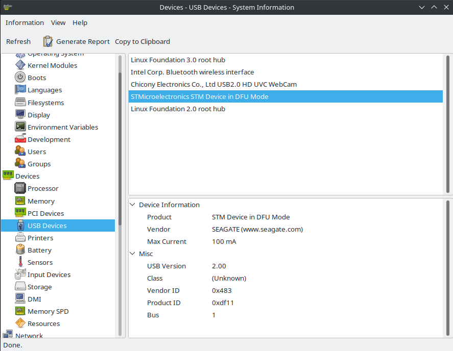

# EBB42: Firmware Deployment Guide
---

The firmware files are located [here](https://github.com/Reiten966/Polyformer/tree/main/Electronics/EBB42%20%2B%20Alexware%20(PF%20Kit)/Firmware), the EBB42 has no firmware installed by default when shipped out. You can upload the firmware using STM32CubeProgrammer or dfu-util.

* Enable USB Power
    
    When connected via USB, the green LED should light up. If it doesnt light up, you need attach the jumper across VUSB.

* Enabling DFU bootloader mode 

    Enabling the DFU bootloader is super easy. Simply hold down the BOOT button. Then press the RST button or power cycle while the board is connected to your computer USB port. The led will glow dull blue if you have done this correclty. If you get no LED's iluminated, make sure the jumper is conected across 'VBUS' After you've hit reset, you can release the BOOT button - it's only checked on powerup

* Check for USB Bootloader device

In Windows, in "Device Manager", you will see the device show up as "STM32 BOOTLOADER" under Universal Serial Bus devices

In MacOS X. Visit the AppleMenu->About This Mac->System Report. Select USB and look for the item labeled "STM32 BOOTLOADER"

In Linux, use HardInfo `sudo apt install hardinfo`

* [Using STM32CubeProg](STM32CubeProg_guide.md): The easiest way by far to program, is to download STM32CubeProg. It's a graphical programmer and does not require Zadig or special command line invocation.

    The only downside is you'll need to make an ST.com account. 
    
    This [video](https://youtu.be/_FELCN8CbWA?t=385) (watch 6:24-8:06) by Eddie shows you how to install any firmware on EBB42, you just need to load the PolyFormerFW_Vx.x.bin file instead.

* [Using dfu-util](dfu-util_guide.md): Command line tool for programming.

## References

<!-- * [EBB42 Introduction](EBB42_introduction.md) -->
<!-- * [Firmware Architecture Overview](firmware_architecture_overview.md) -->
<!-- * [System Firmware Change-log](system_firmware_changelog.md) -->
<!-- * [Windows Driver Installation Guide](windows_driver_installation_guide.md) -->
* [STM32CubeProg Installation Guide](STM32CubeProg_guide.md)
* [dfu-util Installation Guide](dfu-util_guide.md)
* [Polyformer Disord](https://discord.gg/JUNUWZkG)
* [Adafruit](https://learn.adafruit.com/adafruit-stm32f405-feather-express/dfu-bootloader-details)

## Resources

* [Firmware Binaries](https://github.com/Reiten966/Polyformer/tree/main/Electronics/EBB42%20%2B%20Alexware)

## License

Permission is hereby granted, free of charge, to any person obtaining a copy of this software and associated documentation files (the "Software"), to deal in the Software without restriction, including without limitation the rights to use, copy, modify, merge, publish, distribute, sublicense, and/or sell copies of the Software, and to permit persons to whom the Software is furnished to do so, subject to the following conditions:

The above copyright notice and this permission notice shall be included in all copies or substantial portions of the Software.

THE SOFTWARE IS PROVIDED "AS IS", WITHOUT WARRANTY OF ANY KIND, EXPRESS OR IMPLIED, INCLUDING BUT NOT LIMITED TO THE WARRANTIES OF MERCHANTABILITY, FITNESS FOR A PARTICULAR PURPOSE AND NONINFRINGEMENT. IN NO EVENT SHALL THE AUTHORS OR COPYRIGHT HOLDERS BE LIABLE FOR ANY CLAIM, DAMAGES OR OTHER LIABILITY, WHETHER IN AN ACTION OF CONTRACT, TORT OR OTHERWISE, ARISING FROM, OUT OF OR IN CONNECTION WITH THE SOFTWARE OR THE USE OR OTHER DEALINGS IN THE SOFTWARE.
